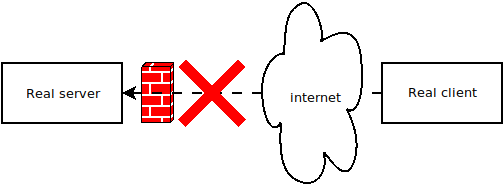
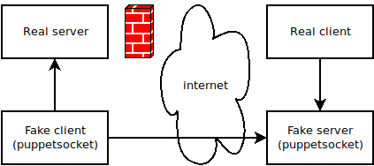

# puppetsocket

puppetsocket is a fake server and fake client to help traverse firewalls by using a reverse connection server -> client.

## Description

puppetsocket is useful in a situation where:

- a server is protected behind a firewall blocking incoming connections (see schema)

- on the opposite, the client side can be reached by the server side (the client side can have a server)
- extra software can be installed and run on server side (and client side)

Then, puppetsocket can be installed on the server-side and client-side to tunnel connections in it.
So the client can connect to the server despite the firewall.

It can be more stable than a SSH tunnel (which is not restarted if the SSH connection is reset).

## Usage

### On the client side

    server.py BIND_ADDRESS_FOR_PUPPET_CLIENT:PORT BIND_ADDRESS_FOR_REAL_CLIENT:PORT

Example:

    server.py 0.0.0.0:5555 localhost:2222

This creates a fake server listening for:
- real client on localhost, port 2222
- fake client on all network, port 5555

After, one can use `ssh -o port=5555 localhost` to connect to real server.

### On the server side

    client.py ADDRESS_OF_REAL_SERVER:PORT ADDRESS_OF_PUPPET_SERVER:PORT

Example:

    client.py localhost:22 1.2.3.4:5555

This creates a fake client connecting to:
- real server on localhost, port 22
- fake server on 1.2.3.4 (address of real client/fake server), port 5555

The fake client can run for extended periods of time, it tries to connect to fake server periodically.
The fake server accepts connections from fake client only when a real client tries to connect.

## License

puppetsocket is licensed under the DO WHAT THE FUCK YOU WANT TO PUBLIC LICENSE version 2.
See COPYING.wtfpl file.